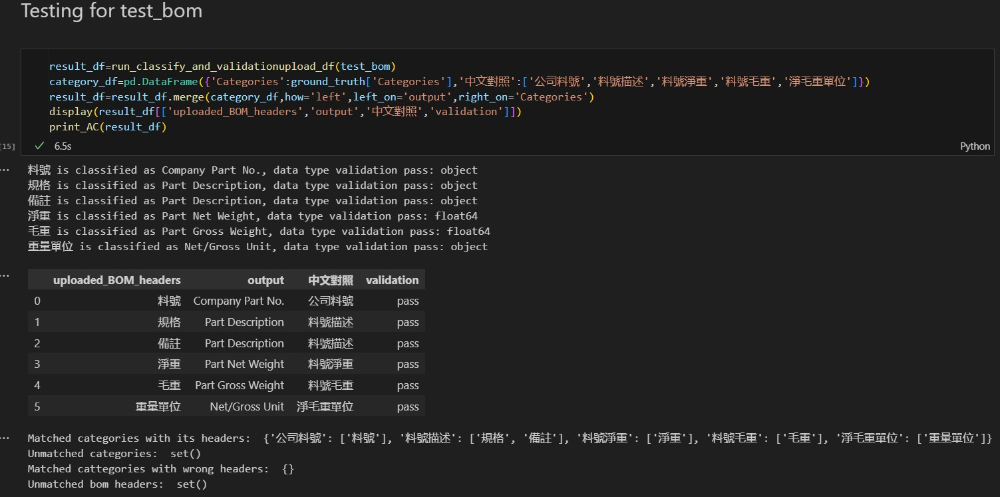
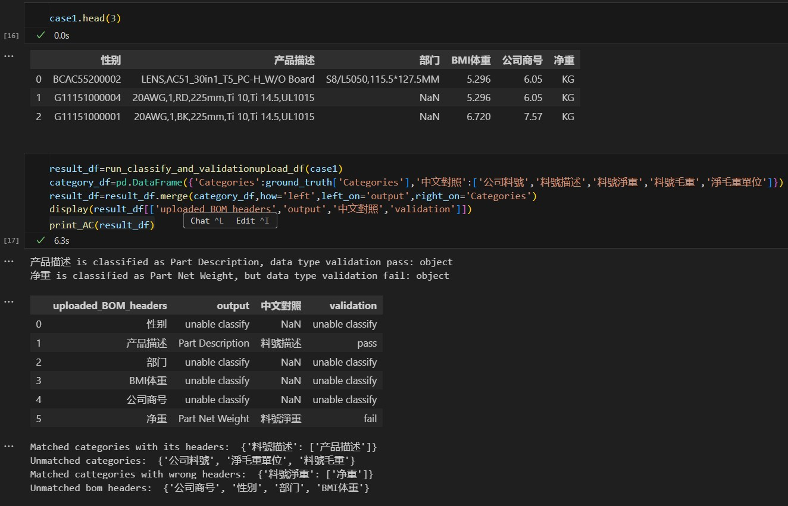
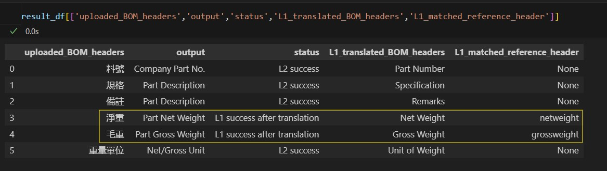
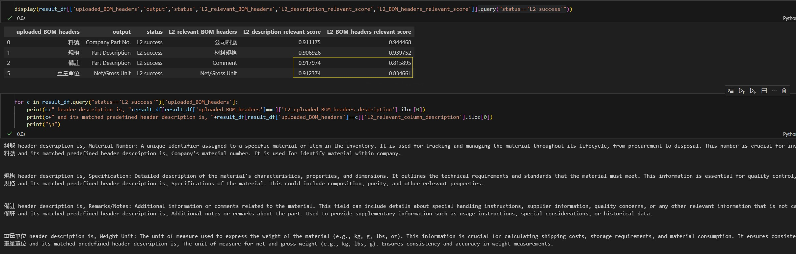

# **BOM Header Classification: Demonstration of LLM in Improving Schema Awareness**
This Jupyter project demonstrates a hybrid solution for recognizing unseen BOM headers uploaded by users and categorizing them correctly.

### **Key Dependencies:**
1. `Langchain Gemini-2.0-flash` is used as the LLM to generate header descriptions, which are later used for embedding and similarity retrieval.
2. `Huggingface intfloat/multilingual-e5-large` is used for text embedding.

### **Dataset Overview:**
1. The *Product Requirements Document* provides detailed requirements and defines the relationship between categories and BOM headers.
2. `bom1.xlsx`, `bom2.xlsx`, and `test_bom.xlsx` contain both English and Traditional Chinese texts.
3. `test_bom.xlsx` is used for testing. Additionally, `case1.xlsx` is created later to test all Acceptance Criteria (AC) results (see below).

### **Objective:**
Design a solution to match unseen uploaded BOM headers with predefined categories. There are four Acceptance Criteria (AC) to measure the results:
1. **Matched categories with their headers**: The solution correctly matches the uploaded BOM headers.
2. **Unmatched categories**: Categories without a matching uploaded BOM header. Assume each category should have at least one matching BOM header for every upload.
3. **Matched categories with incorrect headers**: The solution incorrectly matches the uploaded BOM headers.
4. **Unmatched BOM headers**: The solution is unable to match the uploaded BOM headers to any category.

### **Solution Design Overview**
A hybrid solution consists of:

#### **Classification Logic:**
1. **L1:** Header name matching check, requiring a 100% match. English translation (supported by LLM) and text stripping are applied when it is applicable.
2. **L2:** Similarity retrieval, requiring a cosine similarity score of >=0.9, using only the top result.

#### **Validation Logic:**
1. **V1:** Validate the data type of the classified uploaded column. If it is incorrect, it falls under AC3.

### **Solution Flow**
1. **Data Preparation and Embedding:** Use LLM to generate header descriptions for ground truth headers, then embed the header descriptions for similarity retrieval.
2. **Classification:** Apply L1, then apply L2 to the remaining unclassified uploaded BOM headers.
3. **Validation:** Apply V1.
4. **Output AC:** Generate AC results.

### **Outcomes:**

1. Testing with `test_bom.xlsx`, all headers are classified correctly (only AC1 is found).
   

2. Creating `case1.xlsx` (edge case) generates all AC types.
   

### **Highlights and Learnings:**
1. Adding English translation (via LLM) improves classification for unseen Chinese BOM headers. In `test_bom.xlsx`, *淨重* and *毛重* are often confused during L2, but their English translations, *Net Weight* and *Gross Weight*, perfectly match the predefined BOM headers.
   

2. In L2, a strict criterion is defined: Only if the top retrieved predefined header has a cosine similarity score of >=0.9 can it be used for matching categories. Similarity retrieval using header descriptions yields better results than using header names, likely because longer text provides more distinction in vector space. In this example, *備註* and *重量單位* might not be classified correctly if the header name alone is used for retrieval.
   
